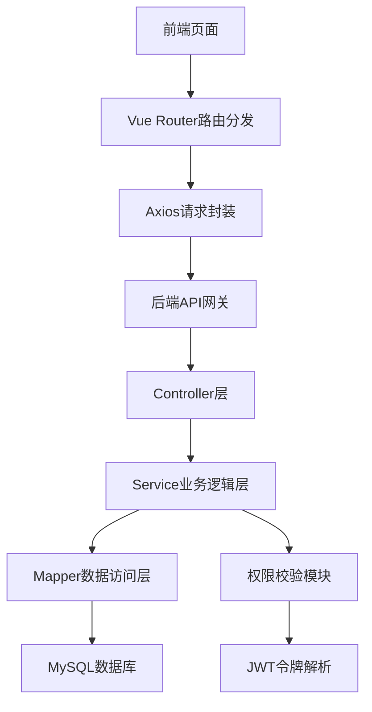

# Bank FinTech Management System
基于 SpringBoot + Vue + MySQL 的银行金融科技管理系统

## 项目背景
随着金融科技的快速发展，银行对数字化管理系统的需求日益提升。本系统聚焦银行信息科技部核心业务场景，旨在实现用户权限精细化管控、交易数据高效管理、业务指标可视化分析，助力银行日常运营效率提升。

## 项目目标
1. 构建一套轻量化、高可用的银行基础管理系统，覆盖核心业务流程；
2. 实践企业级Java开发规范，掌握金融领域常见的权限控制、数据处理方案；
3. 实现前端可视化报表，辅助业务人员快速掌握核心数据指标。

## 技术栈
### 后端
- 核心框架：Java 8+、SpringBoot 2.7.x（企业主流版本）
- 持久层：MyBatis + MyBatis-Plus（简化CRUD操作，提升开发效率）
- 数据库：MySQL 8.0（支持事务、索引优化，适配金融数据安全性要求）
- 安全认证：JWT + RBAC权限模型（实现细粒度的权限管控）
- 工具链：Maven、Lombok、Apache Commons-lang3、FastJSON

### 前端
- 核心框架：Vue 3 + Vue Router + Pinia（状态管理）
- UI组件库：Element Plus（适配管理系统交互风格）
- 数据可视化：ECharts 5.x（实现交易趋势、业务占比等报表展示）
- 工程化：Vite（构建工具）、Axios（接口请求封装）

## 核心功能模块
| 模块名称         | 核心功能                                                                 | 业务价值                                                                 |
|------------------|--------------------------------------------------------------------------|--------------------------------------------------------------------------|
| 用户管理         | 多角色用户增删改查、密码加密存储、账号状态管控（禁用/启用）| 实现银行内部人员账号规范化管理，保障账号安全                             |
| 权限控制         | 基于RBAC的角色分配、菜单权限控制、接口级权限校验                         | 满足银行“最小权限原则”，不同岗位仅可见/可操作对应功能                     |
| 交易记录管理     | 交易流水查询、多条件筛选（时间/金额/交易类型）、交易状态跟踪             | 快速定位交易问题，辅助业务人员处理异常交易                               |
| 数据统计报表     | 交易金额趋势图、用户活跃度分析、各业务线交易占比可视化                   | 直观展示核心业务指标，辅助管理层做决策                                   |
| 系统管理         | 操作日志/异常日志记录、系统参数配置、数据备份与恢复                       | 便于系统运维排查问题，保障数据安全性                                     |

## 快速部署
### 环境依赖
- JDK 8 及以上
- MySQL 8.0 及以上
- Node.js 16+
- Maven 3.6+

### 后端部署步骤
1. 克隆仓库：`git clone https://github.com/你的用户名/bank-fintech-management-system.git`
2. 进入后端目录：`cd bank-fintech-management-system/backend`
3. 数据库准备：
   - 创建数据库：`CREATE DATABASE bank_fintech_db CHARACTER SET utf8mb4 COLLATE utf8mb4_unicode_ci;`
   - 导入初始化脚本：执行 `sql/bank_fintech_db.sql`
4. 配置修改：在 `src/main/resources/application.yml` 中修改MySQL连接信息（账号/密码/数据库名）
5. 启动项目：运行 `com.bank.BankFintechApplication` 主类，默认端口8080

### 前端部署步骤
1. 进入前端目录：`cd bank-fintech-management-system/frontend`
2. 安装依赖：`npm install`
3. 启动开发环境：`npm run dev`（默认端口3000）
4. 访问系统：`http://localhost:3000`（默认管理员账号：admin，密码：123456）

## 系统架构设计
### 整体架构

### 核心设计亮点
1. **权限体系**：通过JWT生成无状态令牌，结合RBAC模型，实现“用户-角色-权限”的解耦，支持动态调整权限；
2. **数据安全**：密码采用BCrypt加密存储，交易数据新增/修改均记录操作日志，满足金融行业数据溯源要求；
3. **性能优化**：交易记录表添加联合索引，优化多条件查询效率；前端采用路由懒加载，提升页面加载速度；
4. **异常处理**：全局异常拦截器统一处理接口异常，返回标准化错误信息，便于前端统一展示。

## 开发规范
### 后端开发规范
- 代码遵循阿里巴巴Java开发手册，类/方法注释完整；
- 分层设计：Controller（仅接收请求/返回结果）→ Service（核心业务逻辑）→ Mapper（仅数据操作）；
- 异常处理：自定义业务异常类，避免直接抛出RuntimeException。

### 前端开发规范
- 组件化开发：公共组件抽离（如查询表单、分页组件），提高复用性；
- 接口统一封装：Axios拦截器处理请求头、响应异常，统一请求前缀；
- 代码风格：遵循ESLint规范，变量/函数命名语义化。

## 版本迭代
- v1.0：完成用户管理、权限控制、交易记录管理核心模块；
- v1.1：新增数据统计报表模块，优化接口响应速度；
- v1.2：完善日志记录、数据备份功能，修复已知BUG。

## 后续优化计划
1. 接入分布式缓存（Redis），提升高频查询接口性能；
2. 增加接口限流功能，防止恶意请求；
3. 对接第三方支付接口（如银联），拓展交易模块功能；
4. 完善前端表单校验，提升用户体验。

## 联系方式
- 邮箱：你的邮箱3071974740@qq.com
- GitHub：https://github.com/Duckweed-yhb

